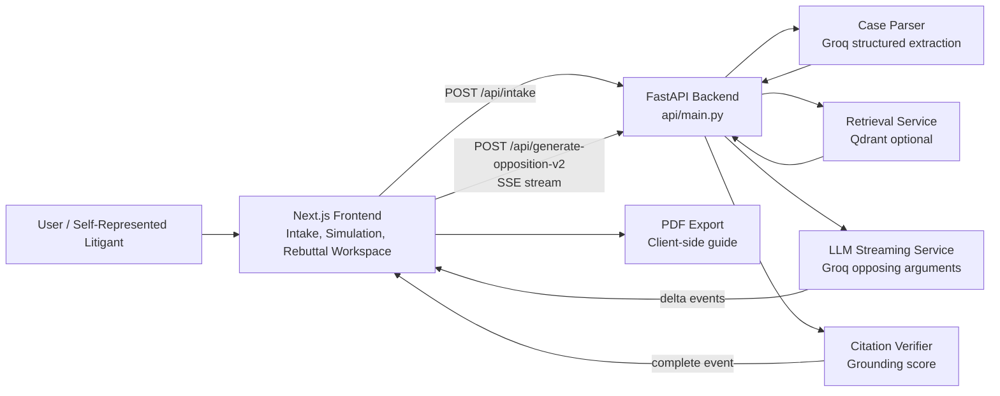

# Opposing-Argument Simulator

AI-powered legal case rehearsal platform for self-represented litigants to practice against simulated opposing counsel.

**Status:** Active prototype with Groq extraction, SSE argument generation, rebuttal workspace, PDF export, optional Qdrant retrieval, and citation verification.

**Built by:** Hasana Zahid, COMSATS University Islamabad

**License:** MIT

> Educational simulation only. This project does not provide legal advice, legal representation, or court-ready legal strategy. Always consult a qualified attorney for real legal matters.

---

## Overview

Self-represented litigants often walk into court without knowing what the other side may argue. This app helps them rehearse by turning case facts into a structured case model, generating likely opposing arguments, and giving the user a workspace to draft rebuttals.

The main workflow is:

1. Enter case details through a guided intake flow.
2. Extract structured facts with a Groq LLM.
3. Optionally retrieve legal authorities from Qdrant.
4. Stream simulated opposing arguments over Server-Sent Events.
5. Verify cited authorities where retrieval is available.
6. Draft rebuttals and export a hearing rehearsal guide as PDF.

---

## Architecture



---

## Key Features

| Feature | Status | Details |
| --- | --- | --- |
| Multi-step case intake | Complete | Guided wizard for parties, claim type, dates, narrative, and evidence |
| Groq LLM extraction | Complete | Converts narrative into structured Pydantic case data |
| SSE argument streaming | Complete | Streams generated opposing arguments as they arrive |
| Qdrant retrieval | Optional | Can be skipped with `QDRANT_SKIP_RETRIEVAL=true` |
| Citation verification | Complete | Flags unverified authorities and reports grounding score |
| Rebuttal workspace | Complete | Draft responses for each simulated argument |
| PDF export | Complete | Exports a hearing rehearsal guide |
| Rebuttal hints | Complete | Lightweight LLM helper for drafting angles |

---

## Tech Stack

| Layer | Technology |
| --- | --- |
| Frontend | Next.js 14, React 18, TypeScript |
| Styling | Tailwind CSS |
| Backend | FastAPI, Pydantic v2 |
| LLM | Groq, Llama 3.3 70B |
| Retrieval | Qdrant, sentence-transformers |
| Streaming | Server-Sent Events |
| PDF | jsPDF |
| Deployment target | Vercel / local development |

---

## Project Structure

```text
legal-case-intake-ai/
|-- api/
|   |-- main.py                       # FastAPI routes
|   |-- models/                       # Pydantic schemas
|   |-- services/
|   |   |-- case_parser.py             # Groq structured extraction
|   |   |-- retrieval_service.py       # Optional Qdrant retrieval
|   |   |-- llm_service.py             # Streaming opposing arguments
|   |   |-- citation_verifier.py       # Grounding verification
|   |-- requirements.txt
|
|-- frontend/
|   |-- src/pages/                    # Landing, intake, simulation
|   |-- src/components/               # Wizard, streaming display, rebuttal UI
|   |-- src/services/                 # API and PDF helpers
|   |-- package.json
|
|-- evals/                            # Evaluation reports and support files
|-- vercel.json
|-- README.md
```

---

## Quick Start

### Prerequisites

- Node.js 18 or newer
- Python 3.11 or newer
- Groq API key from `https://console.groq.com`
- Optional Qdrant Cloud credentials

### 1. Configure Environment

From the project root:

```powershell
cd D:\case_intake_app3\legal-case-intake-ai
copy .env.example .env
notepad .env
```

Minimum local configuration:

```dotenv
GROQ_API_KEY=gsk_your_groq_api_key
QDRANT_SKIP_RETRIEVAL=true
NEXT_PUBLIC_API_BASE_URL=http://localhost:8000
```

To enable retrieval:

```dotenv
QDRANT_SKIP_RETRIEVAL=false
QDRANT_URL=https://your-cluster.qdrant.io:6333
QDRANT_API_KEY=your_qdrant_api_key
```

### 2. Start Backend

```powershell
cd D:\case_intake_app3\legal-case-intake-ai
pip install -r api\requirements.txt
python -m uvicorn api.main:app --reload --port 8000
```

Backend runs at:

```text
http://localhost:8000
http://localhost:8000/docs
```

### 3. Start Frontend

Open a second terminal:

```powershell
cd D:\case_intake_app3\legal-case-intake-ai\frontend
npm install
npm run dev
```

Frontend runs at the URL printed by Next.js, usually:

```text
http://localhost:3000
```

---

## Getting Started: Populate Qdrant with Case Law

The RAG pipeline requires Harvard Caselaw Access Project data in Qdrant Cloud.

### Quick Start (Local Ingestion)

1. **Create Qdrant Cloud account:** https://cloud.qdrant.io/ (free)
2. **Create cluster** and copy credentials
3. **Configure Environment:**
   In `api/.env`, add your credentials:
```bash
   QDRANT_SKIP_RETRIEVAL=false
   QDRANT_URL=your-url
   QDRANT_API_KEY=your-key
```
4. **Install ML Dependencies:**
   From your terminal, install the required packages:
```powershell
   cd api
   pip install huggingface_hub datasets qdrant-client sentence-transformers langchain-text-splitters torch tqdm python-dotenv
```
5. **Run Ingestion Script:**
```powershell
   python scripts/ingest_caselaw.py
```
   *(Takes ~30-45 minutes on a modern CPU, processes 50,000 cases).*
6. **Start app** - RAG now works!

## API Endpoints

| Method | Path | Purpose |
| --- | --- | --- |
| `GET` | `/api/health` | Health check |
| `POST` | `/api/intake` | Submit case and extract structured facts |
| `POST` | `/api/retrieve-authorities` | Debug or inspect retrieval output |
| `POST` | `/api/generate-opposition-v2` | Stream opposing arguments over SSE |
| `POST` | `/api/rebuttal-hints` | Generate rebuttal starting points |

---

## SSE Event Flow

The simulation endpoint streams events in this order:

```text
heartbeat -> delta* -> heartbeat -> retry? -> delta* -> complete
```

Example event:

```text
event: delta
data: {"text":"Generated argument text..."}
```

The final `complete` event contains:

```json
{
  "arguments": [],
  "g_v_score": 0.0,
  "retrieved_authorities": [],
  "insufficient_grounding": false
}
```

---

## Development Checks

Backend syntax check:

```powershell
cd D:\case_intake_app3\legal-case-intake-ai
python -m py_compile api/main.py api/services/llm_service.py api/services/citation_verifier.py
```

Frontend lint:

```powershell
cd D:\case_intake_app3\legal-case-intake-ai\frontend
npm run lint
```

---

## Recent Fixes

- Corrected SSE framing to emit actual newline-delimited events.
- Added `QDRANT_SKIP_RETRIEVAL` support for local testing without Qdrant.
- Prevented missing retrieval response errors when retrieval is skipped or unavailable.
- Fixed prompt construction in `llm_service.py` so JSON examples do not trigger Python `KeyError`.

---

## Known Limitations

- The generated output is for rehearsal only and must not be treated as legal advice.
- Groq free-tier rate limits can affect response availability.
- Retrieval quality depends on the configured Qdrant collection.
- No user authentication or persistent case history is included yet.
- Citation verification checks retrieved authorities; it does not validate the law independently.

---

## Roadmap

- Improve retrieval corpus coverage and metadata filters.
- Add stronger evaluation reports for grounding and hallucination risk.
- Add authentication and saved case history.
- Add jurisdiction-specific prompt packs.
- Add multilingual support.
- Add deployment-ready observability and rate-limit dashboards.

---

## Legal Disclaimer

This tool is an educational simulation. It does not create an attorney-client relationship, does not provide legal advice, and should not be used as a substitute for a qualified lawyer. Generated arguments may be incomplete, inaccurate, outdated, or inappropriate for a real case.

---

## Author

**Hasana Zahid**  
BS Artificial Intelligence  
COMSATS University Islamabad  
GitHub: [@hasana157](https://github.com/hasana157)

---

## License

MIT License. See `LICENSE` for details.
