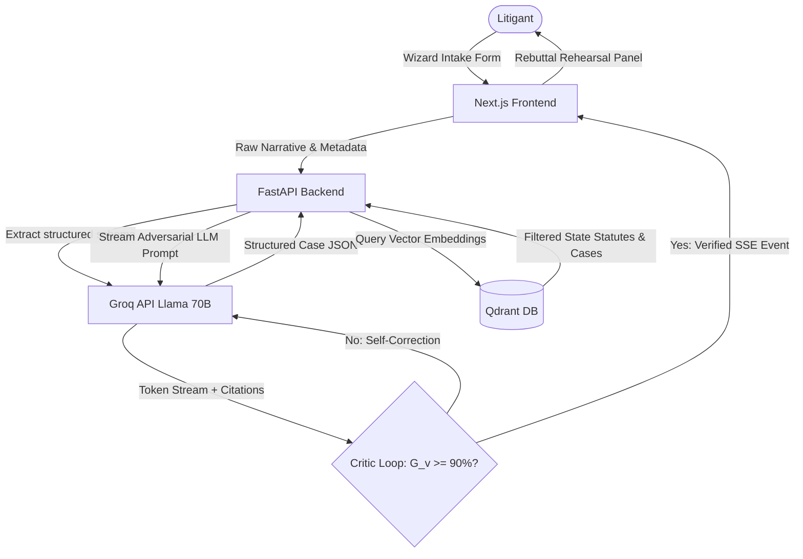

# Opposing-Argument Simulator for Self-Represented Litigants

### *Empowering Access to Justice through Jurisdiction-Grounded Retrieval-Augmented Generation (RAG)*

---

## ⚖️ Project Overview

In civil justice systems, millions of litigants appear in court without legal representation, often facing represented opponents. This asymmetry of preparation—rather than the underlying merits of their case—is a major driver of adverse outcomes.

The **Opposing-Argument Simulator** is an interactive, layperson-facing case-preparation tool designed to bridge this gap. By combining **Retrieval-Augmented Generation (RAG)** with **adversarial LLM simulation**, the application ingests a litigant's dispute narrative, extracts key case facts, retrieves relevant jurisdiction-specific case law and statutes, and simulates the counterarguments and objections opposing counsel is likely to present in a hearing.

---

## 🚀 Key Capabilities

*   **Guided Case Intake & Parsing**: A 5-step wizard interface that structures raw dispute narratives into canonical case data (parties, claims, jurisdiction, dates, evidence).
*   **Jurisdiction-Grounded RAG**: Semantic search using `sentence-transformers/all-MiniLM-L6-v2` against a local persistent **Qdrant Vector DB**, isolated strictly by state/jurisdiction boundaries (e.g., California, Texas, New York, Illinois).
*   **Adversarial Simulation**: Real-time token streaming (via SSE) of counterarguments and evidentiary objections using `llama-3.3-70b-versatile` under an "Opposing Counsel" system persona.
*   **Grounding Critic Loop ($G_v$)**: A verification engine that cross-references generated citations against retrieved authorities. If the grounding verification score ($G_v$) is below **90%**, it triggers an automatic critique-loop rewrite.
*   **Premium Glassmorphic Rehearsal Workspace**: A sleek, modern UI designed with glassmorphic cards, responsive panels, strategic rebuttal guides, hints, and PDF report exporters.

---

## 🛠️ Technology Stack

| Layer | Technology | Purpose |
| :--- | :--- | :--- |
| **Frontend** | Next.js 14, React, TailwindCSS, Lucide icons, Framer Motion | Modern, glassmorphic layout & fluid wizard steps |
| **API Backend** | FastAPI, Uvicorn, Pydantic V2 | High-performance, streaming SSE endpoint & input validation |
| **Vector DB** | Qdrant (Persistent Local Mode) | Fast, isolated similarity search over legal corpora |
| **Embeddings** | Sentence-Transformers (`all-MiniLM-L6-v2`) | Local 384-dimensional dense text embeddings |
| **Generative LLM** | Groq API (`llama-3.3-70b-versatile`) | Fast, instruction-following fact extraction and adversarial generation |

---

## 📐 System Architecture



---

## 📦 Installation & Setup

### Prerequisites
*   Python 3.10+ (using `uv` is highly recommended)
*   Node.js 18+ & `npm`
*   A Groq API key

### 1. Environment Configuration
Create a `.env` file in the root of the project:
```env
GROQ_API_KEY=your-groq-api-key-here
PORT=8000
```

### 2. Backend Installation & Database Seeding
```bash
# Navigate to api directory
cd api

# Install Python dependencies using uv
uv venv
uv pip install -r requirements.txt

# Seed the local Qdrant database with state statutes/cases
uv run seed_qdrant.py
```

### 3. Frontend Installation
```bash
# Navigate to frontend directory
cd ../frontend

# Install Node dependencies
npm install
```

---

## ⚙️ Running Locally

Start the backend and frontend in separate terminals:

### Start FastAPI Server
```bash
cd api
uv run uvicorn main:app --reload --port 8000
```

### Start Next.js Development Server
```bash
cd frontend
npm run dev
```
Open [http://localhost:3000](http://localhost:3000) in your browser.

---

## 📊 Grounding Metrics ($G_v$)

To prevent the LLM from fabricating laws (hallucination), every argument is passed through a **Grounding Verification Engine**:

$$\text{Grounding Score } (G_v) = \frac{\text{Number of Verified Citations}}{\text{Total Citations in Response}}$$

*   **Verified Citation**: A case name or statute matching a record returned by Qdrant.
*   **Unverified Citation**: Any fabricated citation or case outside the isolated jurisdiction. Unverified citations are flagged in the UI with warning indicators, forcing the litigant to practice only against legally grounded arguments.
